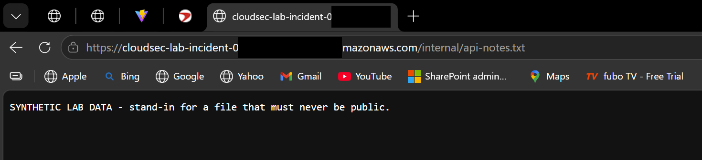
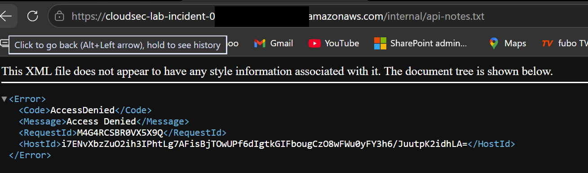
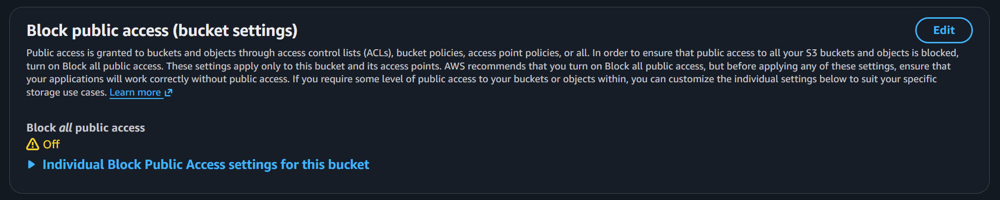
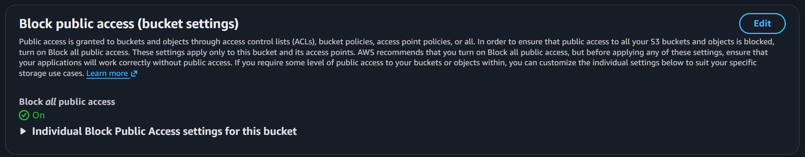
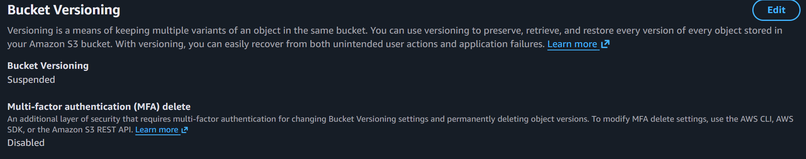
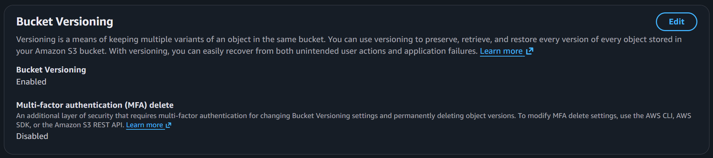
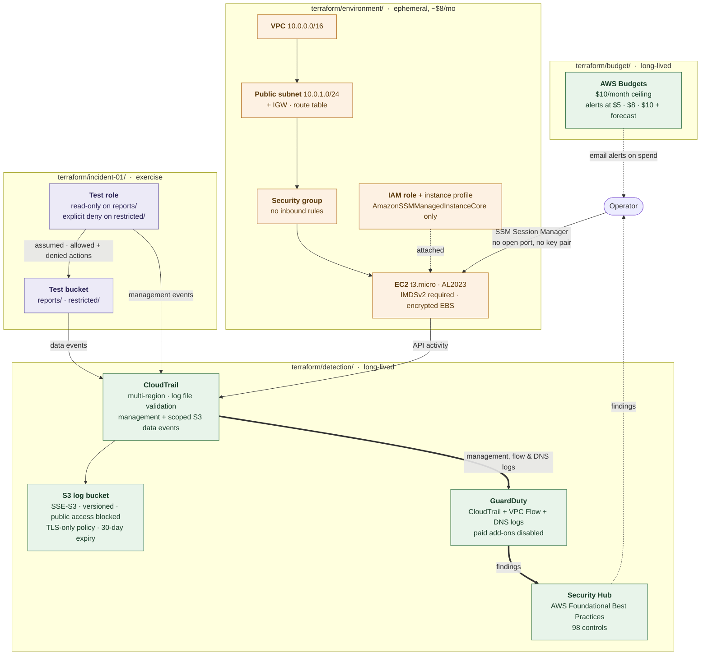

# AWS Cloud Security Lab

A hands-on lab for building and exercising detection and response capabilities in AWS.

## Layout

| Directory | Contents |
| --- | --- |
| `terraform/` | Infrastructure as code for the lab environment |
| `lambda/` | Lambda function source for automated response actions |
| `detections/` | Detection rules and queries |
| `incidents/` | Incident write-ups and investigation notes |
| `diagrams/` | Architecture and data-flow diagrams |
| `screenshots/` | Console evidence captured during exercises |
| `docs/` | Phase-by-phase build documentation |

## Documentation

| Phase | Document | Status |
| --- | --- | --- |
| 1 | [Environment Setup](docs/phase-1-environment-setup.md) | Complete |
| 2 | [Cost Guardrails](docs/phase-2-cost-guardrails.md) | Complete |
| 3 | [Base AWS Environment](docs/phase-3-base-environment.md) | Complete |
| 4 | [Detection Services](docs/phase-4-detection-services.md) | Complete |
| 5 | [Incident #1 — IAM Investigation](docs/phase-5-incident-01.md) | Complete |
| 6 | Detection engineering — alert on denied IAM actions | Planned |

## Incidents

| ID | Report | Summary |
| --- | --- | --- |
| INC-01 | [IAM Role Misuse Investigation](incidents/incident-01-iam.md) | 11 actions from one assumed role; 7 denied including a privilege-escalation attempt. Exposed that 7 of 11 were invisible without CloudTrail data events. |
| INC-02 | [Insecure S3 Configuration](incidents/incident-02-s3.md) | Bucket made publicly readable, detected, investigated, and remediated in a 2m23s exposure window. Exposed that Security Hub's S3 controls detect nothing without AWS Config. |

### INC-02 evidence — before and after remediation

Anonymous request carrying no AWS credentials, against the same object:

| Before — `HTTP 200`, world-readable | After — `HTTP 403 AccessDenied` |
| --- | --- |
|  |  |

Bucket configuration, same console panels:

| Before | After |
| --- | --- |
|  |  |
|  |  |

Remediation was a single Terraform variable — `terraform apply -var=harden=true`,
`Plan: 2 to add, 5 to change` — rather than a sequence of console clicks. Full
write-up in [incidents/incident-02-s3.md](incidents/incident-02-s3.md).

## Architecture



Green is long-lived and always on. Orange is destroyed between sessions to
avoid EC2 charges. Purple is per-exercise.

## Terraform layout

Three states, three lifecycles. Only `environment/` should be destroyed routinely.

| Directory | Lifecycle |
| --- | --- |
| [terraform/budget/](terraform/budget/) | Long-lived. Cost guardrails — leave running. |
| [terraform/detection/](terraform/detection/) | Long-lived. CloudTrail, GuardDuty, Security Hub — leave running. |
| [terraform/environment/](terraform/environment/) | Ephemeral. **Run `terraform destroy` between sessions** — roughly $8/month if left up. |

> **Free trials for GuardDuty and Security Hub end approximately 2026-09-08.**
> Review spend in Cost Explorer before then — see [Phase 4 §6](docs/phase-4-detection-services.md#6-cost).

## Prerequisites

| Tool | Purpose |
| --- | --- |
| [AWS CLI v2](https://docs.aws.amazon.com/cli/latest/userguide/getting-started-install.html) | Authenticating to the lab account and querying resources |
| [Terraform](https://developer.hashicorp.com/terraform/install) | Provisioning and tearing down lab infrastructure |
| [Git](https://git-scm.com/downloads) | Version control |
| [VS Code](https://code.visualstudio.com/) | Editing, with the HashiCorp Terraform and AWS Toolkit extensions |
| [Python 3.12+](https://www.python.org/downloads/) | Lambda function runtime and helper scripts |

On Windows, install the first two with:

```powershell
winget install --id Amazon.AWSCLI -e
winget install --id Hashicorp.Terraform -e
```

Verify each is on `PATH` in a fresh terminal:

```powershell
aws --version; terraform version; git --version; python --version
```

> **Python note:** Lambda code targets **3.13**, matching the `python3.13` Lambda
> runtime. Create the virtualenv with `py -3.13 -m venv .venv` so the interpreter
> is pinned explicitly regardless of what bare `python` resolves to.

## Getting started

_TBD — document AWS account setup, credential profile, and `terraform apply` steps here._
