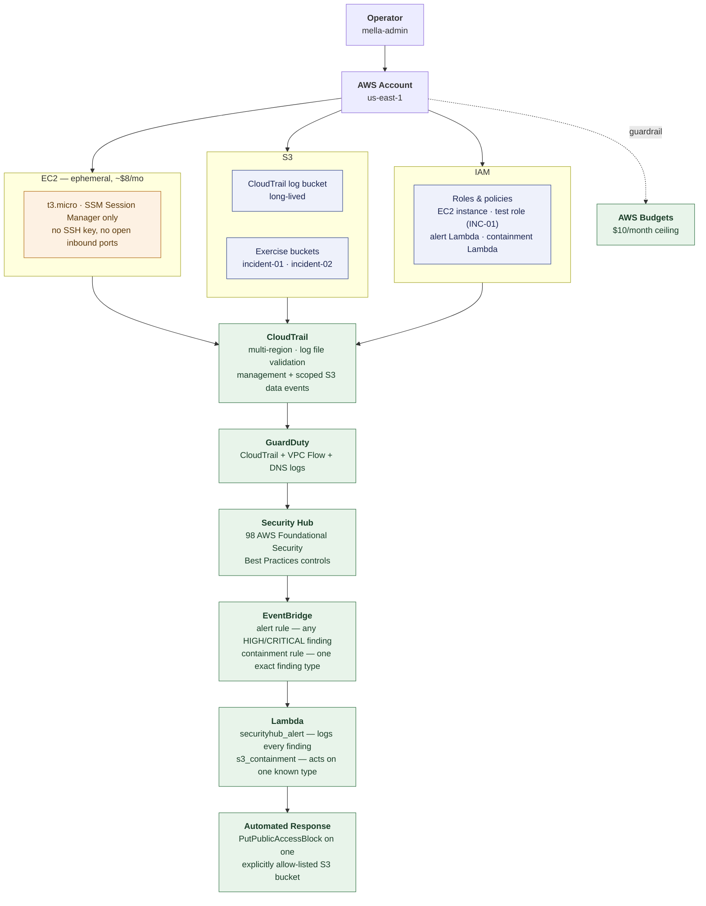
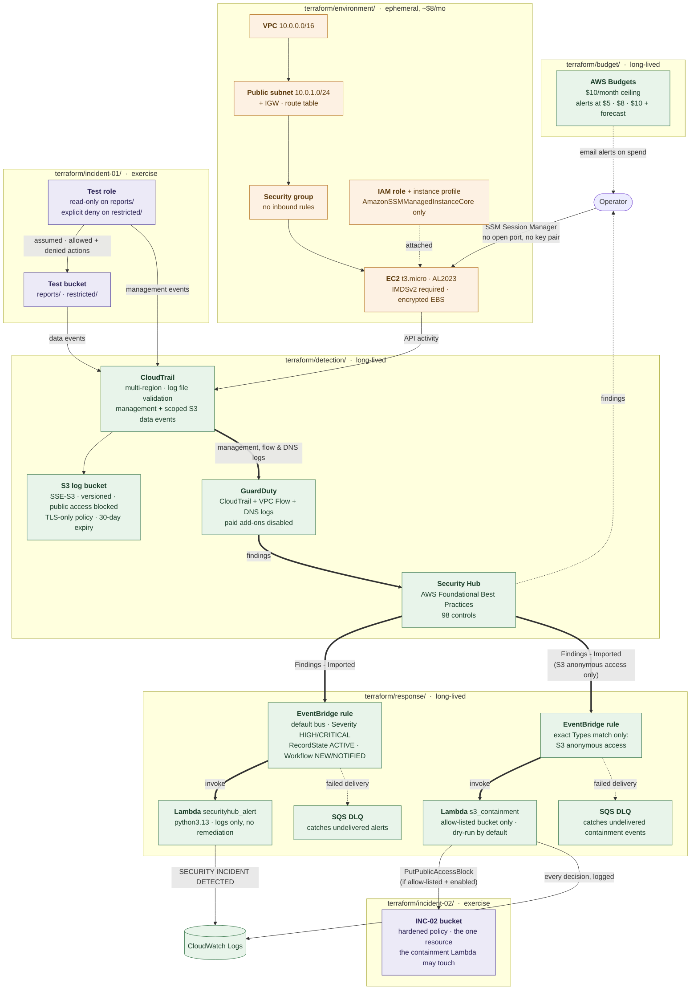
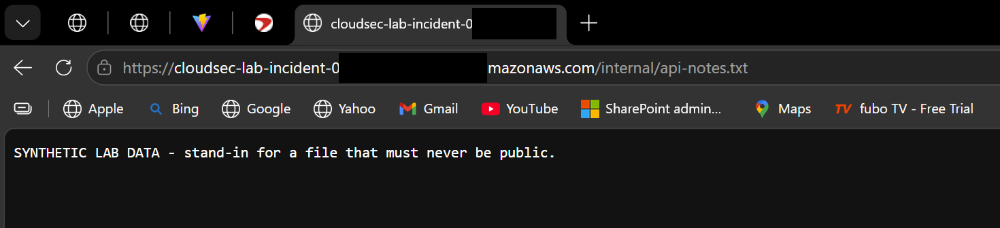
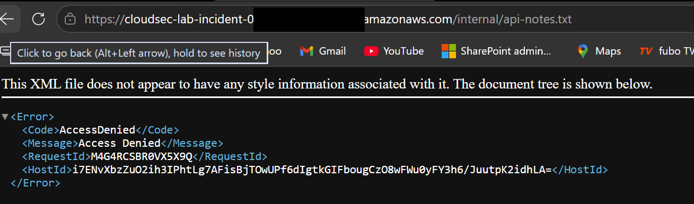
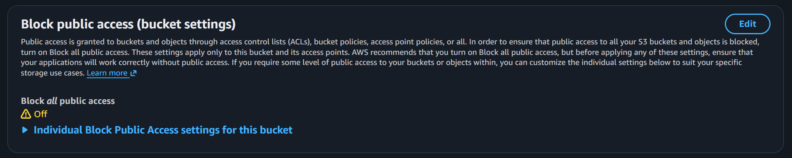
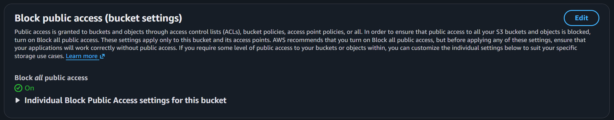
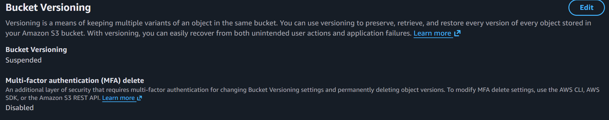
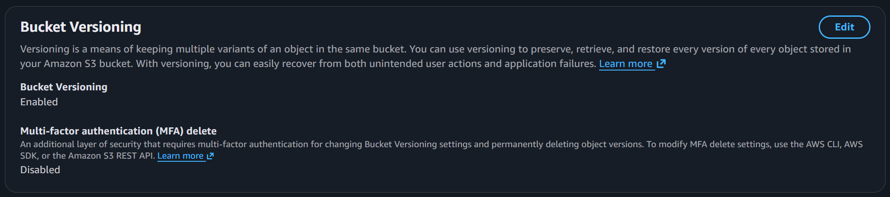

# AWS Cloud Security Detection & Response Lab

A cloud security engineering lab demonstrating
threat detection, security monitoring, incident
investigation and automated remediation within AWS.


Ten phases, three real incident investigations, and one real production bug
found and fixed live against the actual AWS account — not a sandbox mockup.
Every number in this README (timestamps, finding IDs, exposure windows) is
sourced from real CloudTrail, GuardDuty, Security Hub, and CloudWatch Logs
output, captured during the work, not written after the fact.

## Results

| Metric | Value |
| --- | --- |
| Security incidents investigated & written up | **3** — [INC-01](incidents/incident-01-iam.md), [INC-02](incidents/incident-02-s3.md), [INC-03](incidents/incident-03-automated-containment.md) |
| Detection workflows | **3** — real-time Security Hub/EventBridge alerting (any HIGH/CRITICAL finding), a custom 6-control S3 posture check, CloudTrail-based IAM session reconstruction |
| Automated remediation workflows | **1, deliberately** — one known finding type, one allow-listed resource, one non-destructive API call (see [why narrow beats broad](docs/phase-9-automated-containment.md#1-the-scope-decision)) |
| Infrastructure deployed via Terraform | **100%** — 6 independent state directories, zero console-created resources |
| Lambda unit tests | **32 passing**, zero network calls, zero real AWS credentials required |
| EventBridge → Lambda invocation latency | **< 1 second**, consistently, Phases 7–9 |
| Finding import → verified automated remediation | **~12 seconds** end to end (synthetic self-test, post-fix — [INC-03](incidents/incident-03-automated-containment.md#6-verification)) |
| Real-world GuardDuty detection latency | **~7m19s**, genuine `PutBucketPolicy` → GuardDuty finding, measured once live, not assumed |
| Monthly cost ceiling | **$10**, hard budget, alerts at $5 / $8 / $10 + forecast |

> **The number that isn't flattering, included anyway:** the first time the
> automated remediation above ran against a real attack — not a synthetic
> test — it failed silently on every attempt, and the exposure it was built
> to close instead lasted **~94 hours** before a manual check caught it. Two
> real bugs, root-caused from raw CloudTrail and CloudWatch evidence (not
> guessed at), fixed, and re-verified live the same day they were found. A
> fast demo is easy to stage; a real failure, found and fixed, is the actual
> proof this works. Full story:
> [incidents/incident-03-automated-containment.md](incidents/incident-03-automated-containment.md).

**Jump to:** [Results](#results) ·
[Architecture](#architecture) ·
[Technologies](#technologies) ·
[Security Objectives](#security-objectives) ·
[Infrastructure Deployment](#infrastructure-deployment) ·
[Detection Pipeline](#detection-pipeline) ·
[Incident Scenarios](#incident-scenarios) ·
[Automated Response](#automated-response) ·
[Incident Investigation](#incident-investigation) ·
[Screenshots](#screenshots) ·
[Security Considerations](#security-considerations) ·
[Lessons Learned](#lessons-learned)

---

## Architecture

The big picture: one AWS account, three resource pillars feeding one
detection pipeline, ending in one narrowly-scoped automated response.


```mermaid
flowchart TB
    IAM0["<b>Operator</b><br/>mella-admin"]
    ACCT["<b>AWS Account</b><br/>us-east-1"]
    BUD["<b>AWS Budgets</b><br/>$10/month ceiling"]

    IAM0 --> ACCT
    ACCT -.->|"guardrail"| BUD

    ACCT --> EC2G
    ACCT --> S3G
    ACCT --> IAMG

    subgraph EC2G["EC2 — ephemeral, ~$8/mo"]
        EC2["t3.micro · SSM Session Manager only<br/>no SSH key, no open inbound ports"]
    end

    subgraph S3G["S3"]
        S3LOG["CloudTrail log bucket<br/>long-lived"]
        S3EX["Exercise buckets<br/>incident-01 · incident-02"]
    end

    subgraph IAMG["IAM"]
        ROLES["Roles & policies<br/>EC2 instance · test role (INC-01)<br/>alert Lambda · containment Lambda"]
    end

    EC2G --> CT
    S3G --> CT
    IAMG --> CT

    CT["<b>CloudTrail</b><br/>multi-region · log file validation<br/>management + scoped S3 data events"]
    CT --> GD["<b>GuardDuty</b><br/>CloudTrail + VPC Flow + DNS logs"]
    GD --> SH["<b>Security Hub</b><br/>98 AWS Foundational Security<br/>Best Practices controls"]
    SH --> EB["<b>EventBridge</b><br/>alert rule — any HIGH/CRITICAL finding<br/>containment rule — one exact finding type"]
    EB --> LAM["<b>Lambda</b><br/>securityhub_alert — logs every finding<br/>s3_containment — acts on one known type"]
    LAM --> AR["<b>Automated Response</b><br/>PutPublicAccessBlock on one<br/>explicitly allow-listed S3 bucket"]

    classDef longlived fill:#e8f4ea,stroke:#3d7a4f,color:#1a3d28
    classDef ephemeral fill:#fdf1e3,stroke:#b5711f,color:#5c3a0c
    classDef pillar fill:#eef1fb,stroke:#3a4d8f,color:#1b2550
    class BUD,CT,GD,SH,EB,LAM,AR longlived
    class EC2 ephemeral
    class S3LOG,S3EX,ROLES pillar
```

Reading the shape: everything above `CloudTrail` is *what the account does*
— three independent pillars (compute, storage, identity) that all produce
activity. Everything from `CloudTrail` down is *one linear pipeline* that
turns that activity into a decision: log it (always), or, for exactly one
known finding type against exactly one known resource, also fix it.

The module-by-module version — every Terraform directory, lifecycle
color-coding, exact EventBridge filter criteria — is further down in
[Infrastructure Deployment](#infrastructure-deployment), and as its own file
at [diagrams/architecture.md](diagrams/architecture.md).

---

## Technologies

| Category | Used here |
| --- | --- |
| **Infrastructure as code** | Terraform 1.15, `hashicorp/aws` provider, `hashicorp/archive` (Lambda packaging) — six independent state directories, one per lifecycle |
| **Detection** | CloudTrail (multi-region, management + scoped S3 data events), GuardDuty (CloudTrail + VPC Flow + DNS), Security Hub (AWS Foundational Security Best Practices, 98 controls) |
| **Response** | EventBridge (two rules — broad alert, narrow containment), Lambda (Python 3.13 — `securityhub_alert`, `incident_containment`), SQS (dead-letter queues, both EventBridge-target-level and function-level) |
| **Observability** | CloudWatch Logs (structured JSON + human-readable alert blocks), CloudWatch Log Insights-ready output |
| **Cost control** | AWS Budgets ($10/month ceiling, alerts at $5/$8/$10 + forecast) |
| **Language / runtime** | Python 3.13 + boto3/botocore, PowerShell 5.1 (detection and self-test scripts) |
| **Testing** | `unittest` / `pytest` — 32 tests across both Lambda handlers, no network calls, no real AWS credentials required |
| **Tooling** | AWS CLI v2, Git, VS Code, Claude Code |

---

## Security Objectives

- **Detect real misconfigurations with native AWS services** — no
  third-party SIEM, no agent install, nothing beyond what GuardDuty,
  Security Hub, and CloudTrail provide out of the box.
- **Investigate from raw evidence, not a dashboard summary.** Every incident
  report in this repo is reconstructed from CloudTrail `lookup-events`,
  GuardDuty `get-findings`, and CloudWatch Logs directly — the kind of
  evidence that holds up in a real investigation, not a screenshot of a
  console banner.
- **Automate response only where the blast radius is explicit and bounded.**
  The one Lambda in this repo authorized to write to a real resource acts on
  exactly one finding type, against exactly one allow-listed resource, with
  one non-destructive, idempotent API call — never "any HIGH finding →
  remediate." See [Automated Response](#automated-response).
- **Keep cost bounded without silently losing coverage.** A hard $10/month
  budget ceiling, and every cost-driven decision (skipping AWS Config,
  disabling GuardDuty's paid protection plans) documented as an explicit
  trade-off with a compensating control, not a silent gap.
- **Treat the lab itself as something that can fail, and prove it.** Phase
  10 didn't just test the automated response in theory — it ran the real
  attack against the real account and found a real bug. See
  [incidents/incident-03-automated-containment.md](incidents/incident-03-automated-containment.md).

---

## Infrastructure Deployment

Six Terraform state directories, deliberately separated by lifecycle so a
single `apply`/`destroy` can never touch more than one blast radius:

| Directory | Lifecycle |
| --- | --- |
| [terraform/budget/](terraform/budget/) | Long-lived. Cost guardrails — leave running. |
| [terraform/detection/](terraform/detection/) | Long-lived. CloudTrail, GuardDuty, Security Hub — leave running. |
| [terraform/response/](terraform/response/) | Long-lived. EventBridge rules, alert Lambda, containment Lambda, DLQs — leave running. |
| [terraform/environment/](terraform/environment/) | Ephemeral. **Run `terraform destroy` between sessions** — roughly $8/month if left up. |
| [terraform/incident-01/](terraform/incident-01/), [terraform/incident-02/](terraform/incident-02/) | Exercise. One bucket/role per incident, toggled insecure/hardened by a single variable. |

<details>
<summary>Module-by-module architecture diagram</summary>


```mermaid
flowchart TB
    subgraph budget["terraform/budget/ &nbsp;·&nbsp; long-lived"]
        BUD["<b>AWS Budgets</b><br/>$10/month ceiling<br/>alerts at $5 · $8 · $10 + forecast"]
    end

    subgraph detection["terraform/detection/ &nbsp;·&nbsp; long-lived"]
        CT["<b>CloudTrail</b><br/>multi-region · log file validation<br/>management + scoped S3 data events"]
        S3L["<b>S3 log bucket</b><br/>SSE-S3 · versioned · public access blocked<br/>TLS-only policy · 30-day expiry"]
        GD["<b>GuardDuty</b><br/>CloudTrail + VPC Flow + DNS logs<br/>paid add-ons disabled"]
        SH["<b>Security Hub</b><br/>AWS Foundational Best Practices<br/>98 controls"]
    end

    subgraph response["terraform/response/ &nbsp;·&nbsp; long-lived"]
        EB["<b>EventBridge rule</b><br/>default bus · Severity HIGH/CRITICAL<br/>RecordState ACTIVE · Workflow NEW/NOTIFIED"]
        LAM["<b>Lambda</b> securityhub_alert<br/>python3.13 · logs only, no remediation"]
        DLQ["<b>SQS DLQ</b><br/>catches undelivered alerts"]
        EB2["<b>EventBridge rule</b><br/>exact Types match only:<br/>S3 anonymous access"]
        CLAM["<b>Lambda</b> s3_containment<br/>allow-listed bucket only · dry-run by default"]
        CDLQ["<b>SQS DLQ</b><br/>catches undelivered containment events"]
    end

    subgraph env["terraform/environment/ &nbsp;·&nbsp; ephemeral, ~$8/mo"]
        VPC["<b>VPC</b> 10.0.0.0/16"]
        SUB["<b>Public subnet</b> 10.0.1.0/24<br/>+ IGW · route table"]
        SG["<b>Security group</b><br/>no inbound rules"]
        EC2["<b>EC2</b> t3.micro · AL2023<br/>IMDSv2 required · encrypted EBS"]
        ROLE["<b>IAM role</b> + instance profile<br/>AmazonSSMManagedInstanceCore only"]
    end

    subgraph inc["terraform/incident-01/ &nbsp;·&nbsp; exercise"]
        TROLE["<b>Test role</b><br/>read-only on reports/<br/>explicit deny on restricted/"]
        TB["<b>Test bucket</b><br/>reports/ · restricted/"]
    end

    subgraph inc2["terraform/incident-02/ &nbsp;·&nbsp; exercise"]
        INC2B["<b>INC-02 bucket</b><br/>hardened policy · the one resource<br/>the containment Lambda may touch"]
    end

    OP(["Operator"]) -->|"SSM Session Manager<br/>no open port, no key pair"| EC2
    VPC --> SUB --> SG --> EC2
    ROLE -.attached.-> EC2

    EC2 -->|API activity| CT
    TROLE -->|"assumed · allowed + denied actions"| TB
    TB -->|data events| CT
    TROLE -->|management events| CT

    CT --> S3L
    CT ==>|"management, flow & DNS logs"| GD
    GD ==>|findings| SH
    SH ==>|"Findings - Imported"| EB
    EB ==>|invoke| LAM
    EB -.->|"failed delivery"| DLQ
    LAM -->|"SECURITY INCIDENT DETECTED"| CWL[("CloudWatch Logs")]
    SH ==>|"Findings - Imported<br/>(S3 anonymous access only)"| EB2
    EB2 ==>|invoke| CLAM
    EB2 -.->|"failed delivery"| CDLQ
    CLAM -->|"PutPublicAccessBlock<br/>(if allow-listed + enabled)"| INC2B
    CLAM -->|"every decision, logged"| CWL

    BUD -.->|"email alerts on spend"| OP
    SH -.->|findings| OP

    classDef longlived fill:#e8f4ea,stroke:#3d7a4f,color:#1a3d28
    classDef ephemeral fill:#fdf1e3,stroke:#b5711f,color:#5c3a0c
    classDef exercise fill:#eceaf7,stroke:#5b4b9e,color:#2c2456
    class BUD,CT,S3L,GD,SH,EB,LAM,DLQ,EB2,CLAM,CDLQ,CWL longlived
    class VPC,SUB,SG,EC2,ROLE ephemeral
    class TROLE,TB,INC2B exercise
```

Green is long-lived and always on. Orange is destroyed between sessions to
avoid EC2 charges. Purple is per-exercise.

</details>

> **Free trials for GuardDuty and Security Hub end approximately 2026-09-08.**
> Review spend in Cost Explorer before then — see [Phase 4 §6](docs/phase-4-detection-services.md#6-cost).

### Prerequisites

| Tool | Purpose |
| --- | --- |
| [AWS CLI v2](https://docs.aws.amazon.com/cli/latest/userguide/getting-started-install.html) | Authenticating to the lab account and querying resources |
| [Terraform](https://developer.hashicorp.com/terraform/install) | Provisioning and tearing down lab infrastructure |
| [Git](https://git-scm.com/downloads) | Version control |
| [VS Code](https://code.visualstudio.com/) | Editing, with the HashiCorp Terraform and AWS Toolkit extensions |
| [Python 3.13](https://www.python.org/downloads/) | Lambda function runtime and helper scripts |

```powershell
winget install --id Amazon.AWSCLI -e
winget install --id Hashicorp.Terraform -e
aws --version; terraform version; git --version; python --version
```

> **Python note:** Lambda code targets **3.13**, matching the `python3.13`
> Lambda runtime. Create the virtualenv with `py -3.13 -m venv .venv` so the
> interpreter is pinned explicitly regardless of what bare `python` resolves
> to.

### Deploying it yourself

Each directory below is its own Terraform state — apply them in this order
the first time; after that, any one can be re-applied independently.

```powershell
# 1. Cost guardrail first - so nothing else can silently overspend
cd terraform/budget;      terraform init; terraform apply

# 2. Always-on detection
cd ../detection;          terraform init; terraform apply

# 3. Alerting + automated containment (dry-run by default - see below)
cd ../response;           terraform init; terraform apply

# 4. Ephemeral exercise environment - destroy when not actively using it
cd ../environment;        terraform init; terraform apply
#   ... work ...
terraform destroy

# 5. Incident exercises - one bucket/role per incident, toggled by a variable
cd ../incident-02;        terraform init; terraform apply -var harden=true
```

`terraform/response/terraform.tfvars.example` documents every override,
including `enable_auto_containment` — **off by default.** A fresh deploy logs
every decision the containment Lambda would have made without ever calling a
mutating API; flip it to `true` only after reviewing a few
`would_contain_but_disabled` log lines. See
[Automated Response](#automated-response).

---

## Detection Pipeline

```
AWS API activity → CloudTrail → GuardDuty → Security Hub → EventBridge → Lambda
```

- **CloudTrail** ([Phase 4](docs/phase-4-detection-services.md)) — multi-region,
  log file validation on, management events plus S3 data events scoped to
  this lab's own exercise buckets (so investigations can answer "was this
  object actually read," not just "was the bucket policy changed").
- **GuardDuty** — continuous analysis of CloudTrail, VPC Flow Logs, and DNS
  logs. Paid protection plans (Malware Protection, Runtime Monitoring)
  deliberately disabled — a documented cost decision, not an oversight.
- **Security Hub** — the AWS Foundational Security Best Practices standard,
  98 controls. **Documented honestly, not just enabled:** those controls
  report "ENABLED" while detecting nothing for S3, because their evaluation
  engine is AWS Config, which this lab does not run (another explicit
  cost/coverage trade-off — see [Incident 02 §2](incidents/incident-02-s3.md#2-detection)).
  Custom PowerShell checks in [`detections/`](detections/) are the
  compensating control.
- **EventBridge → Lambda** ([Phase 7](docs/phase-7-eventbridge-alerting.md),
  [Phase 8](docs/phase-8-incident-handler.md)) — every Security Hub finding
  at `HIGH`/`CRITICAL` severity reaches a Lambda within seconds and is logged
  with all nine fields an analyst needs to triage (`SECURITY INCIDENT
  DETECTED`: Finding ID, Finding, Type, Description, Resource, Severity,
  Account, Region, Timestamp) — no console trip required.

**Real, measured latency** (from [Incident 03](incidents/incident-03-automated-containment.md),
not a synthetic test): a genuine `PutBucketPolicy` misconfiguration to a
GuardDuty finding update took **~7m19s**; GuardDuty's update to the alert
Lambda actually firing took a further **~15m**. EventBridge itself is the
fast part of this chain — the detection services are where real-world
latency actually lives, and this repo measured that instead of assuming it.

---

## Incident Scenarios

| ID | Report | Summary |
| --- | --- | --- |
| INC-01 | [IAM Role Misuse Investigation](incidents/incident-01-iam.md) | 11 actions from one assumed role; 7 denied including a privilege-escalation attempt. Exposed that 7 of 11 were invisible without CloudTrail data events. |
| INC-02 | [Insecure S3 Configuration](incidents/incident-02-s3.md) | Bucket made publicly readable, detected, investigated, and remediated in a 2m23s exposure window. Exposed that Security Hub's S3 controls detect nothing without AWS Config. |
| INC-03 | [Automated Containment's Live Fire-Drill](incidents/incident-03-automated-containment.md) | A real GuardDuty detection reached the Phase 9 containment Lambda, which then crashed on every invocation — wrong IAM action names, masked by a second bug in its own error handling. ~94h exposure before discovery; root-caused, fixed, and re-verified live. |

### INC-02 evidence — before and after remediation

Anonymous request carrying no AWS credentials, against the same object:

| Before — `HTTP 200`, world-readable | After — `HTTP 403 AccessDenied` |
| --- | --- |
|  |  |

Bucket configuration, same console panels:

| Before | After |
| --- | --- |
|  |  |
|  |  |

Remediation was a single Terraform variable — `terraform apply -var=harden=true`,
`Plan: 2 to add, 5 to change` — rather than a sequence of console clicks.

---

## Automated Response

One Lambda (`cloudsec-lab-s3-containment`) is authorized to write to a real
resource — deliberately scoped to the narrowest version of the job
([Phase 9](docs/phase-9-automated-containment.md)):

```
known finding type  +  known lab resource  +  approved remediation  →  Lambda
```

not "any HIGH finding → remediate." Concretely: one exact ASFF `Types` value
(GuardDuty's S3-anonymous-access-granted finding, as Security Hub renders
it), one explicit bucket-ARN allowlist, and one idempotent, non-destructive
call (`s3:PutPublicAccessBlock`, all four settings `true`) — never a policy
rewrite, never a delete. Two independent gates (`enable_auto_containment`
**and** the allowlist) must both agree before anything is touched, and every
decision — including every time it decides *not* to act — is logged.

**This isn't a design claim taken on faith.** [Phase 10](docs/phase-10-live-fire-drill.md)
ran the real attack against the real account and let the real pipeline
respond. It found a real bug — the deployed IAM policy granted the wrong
action names, masked by a second bug in the handler's own error handling,
leaving the exercise bucket exposed for about 94 hours before a manual
recheck caught it. Full root cause, fix, and live re-verification:
[incidents/incident-03-automated-containment.md](incidents/incident-03-automated-containment.md).

---

## Incident Investigation

Every incident in this repo is reconstructed from primary evidence, not
summarized from a console banner:

- **CloudTrail `lookup-events`**, reconstructed into a chronological timeline
  — INC-01 and INC-03 both include a full management-event table with
  principal, action, and significance columns.
- **Custom detection scripts** —
  [`incidents/incident-01/investigate.ps1`](incidents/incident-01/investigate.ps1)
  (IAM session reconstruction from CloudTrail), and in
  [`detections/`](detections/): `s3-posture-check.ps1` (six-control S3
  posture check that Security Hub's own controls could not perform without
  AWS Config) and the self-test scripts that exercise the live
  alerting/containment pipeline end to end.
- **Direct verification against the real API**, not just a log line — every
  remediation in this repo is confirmed by re-querying the actual resource
  state (`get-public-access-block`, an anonymous `curl` request) rather than
  trusting that a "contained" log message means the API call actually
  succeeded.
- **A tooling defect, found and documented, not hidden.** INC-02's own
  investigation tooling silently dropped four CloudTrail events over a
  PowerShell JSON-parsing edge case — logged as a remediation item, because
  an investigation tool that loses evidence is worse than no tool.

| Incident | Investigative technique it showcases |
| --- | --- |
| [INC-01](incidents/incident-01-iam.md) | CloudTrail session reconstruction; why data events (not just management events) are necessary to see 7 of 11 actions |
| [INC-02](incidents/incident-02-s3.md) | Catching a compliance dashboard reporting "enabled" controls that detect nothing, via an independent custom check |
| [INC-03](incidents/incident-03-automated-containment.md) | Root-causing a live automation failure from CloudTrail `errorCode`/`errorMessage` and a raw Lambda traceback, not just "it didn't work" |

---

## Screenshots

Every category below is backed by **real evidence already captured from this
account** during the work — shown here as the actual CLI/log output rather
than invented. The PNG console captures themselves are the one piece of this
README still pending manual capture (this assistant has API/CLI access to
the account but no browser), tracked with the exact console path needed for
each in [screenshots/README.md](screenshots/README.md)'s shot list.

<details>
<summary><b>1. GuardDuty finding</b> — <code>Policy:S3/BucketAnonymousAccessGranted</code></summary>

```json
{
  "Id": "66cff41a3cd156e2591849cf30f0cfb1",
  "Type": "Policy:S3/BucketAnonymousAccessGranted",
  "Severity": 8.0,
  "Title": "Amazon S3 Public Anonymous Access was granted for the S3 bucket cloudsec-lab-incident-02-...",
  "Service": { "Count": 2, "Archived": false },
  "Resource": { "ResourceType": "AccessKey" }
}
```

Capture: GuardDuty console → Findings → this finding, expanded detail panel.
Save as `screenshots/11-guardduty-finding.png`.

</details>

<details>
<summary><b>2. Security Hub finding</b> — same finding, imported</summary>

```json
{
  "Id": "arn:aws:guardduty:us-east-1:...:detector/.../finding/66cff41a3cd156e2591849cf30f0cfb1",
  "RecordState": "ACTIVE",
  "Workflow": { "Status": "NEW" },
  "Severity": { "Label": "HIGH" }
}
```

Capture: Security Hub console → Findings → filter by this finding ID.
Save as `screenshots/11-securityhub-finding.png`.

</details>

<details>
<summary><b>3. CloudTrail event</b> — the <code>PutBucketPolicy</code> that caused it</summary>

```
EventName:  PutBucketPolicy
EventTime:  2026-10-02T20:53:53Z
EventId:    db633095-ee0f-4f6a-b03f-f78abddd6363
UserName:   mella-admin
```

Capture: CloudTrail console → Event history → this event, expanded.
Save as `screenshots/11-cloudtrail-putbucketpolicy.png`.

</details>

<details>
<summary><b>4. EventBridge rule</b> — the narrow containment rule</summary>

```json
{
  "Name": "cloudsec-lab-s3-anonymous-access-containment",
  "State": "ENABLED",
  "EventPattern": "{\"detail\":{\"findings\":{\"RecordState\":[\"ACTIVE\"],\"Types\":[\"TTPs/Policy:S3-BucketAnonymousAccessGranted\"]}},\"detail-type\":[\"Security Hub Findings - Imported\"],\"source\":[\"aws.securityhub\"]}"
}
```

Capture: EventBridge console → Rules → this rule → Event pattern tab.
Save as `screenshots/11-eventbridge-rule.png`.

</details>

<details>
<summary><b>5. Lambda execution</b> — the containment Lambda, post-fix</summary>

```
[WARNING] 2026-10-06T19:24:20.259Z  5ff5bc91-a7b8-4350-a5b2-cdaf84e53b80
{"containment_action": "contained", "finding_id": "lab-phase9-selftest-704af0899cdb",
 "finding_types": ["TTPs/Policy:S3-BucketAnonymousAccessGranted"], ...}
```

Capture: CloudWatch Logs → `/aws/lambda/cloudsec-lab-s3-containment` → this
log stream, `[WARNING]` row expanded. Save as
`screenshots/11-lambda-execution-contained.png`.

</details>

<details>
<summary><b>6. Terraform apply</b> — deploying the containment fix</summary>

```
Plan: 1 to add, 2 to change, 0 to destroy.
  + aws_iam_role_policy.containment_dlq_send will be created
  ~ aws_iam_role_policy.containment_s3[0] will be updated in-place
  ~ aws_lambda_function.containment will be updated in-place
      + dead_letter_config { target_arn = "arn:aws:sqs:...cloudsec-lab-s3-containment-dlq" }
Apply complete! Resources: 1 added, 2 changed, 0 destroyed.
```

Capture: terminal running this `terraform apply`. Save as
`screenshots/11-terraform-apply.png`.

</details>

<details>
<summary><b>7. Automated remediation</b> — verified against the real S3 API</summary>

```
==> Result
    containment_action = contained
    PASS  logged 'contained' as expected
    PASS  S3 confirms Block Public Access is restored - the Lambda actually
          made the API call
==> Checking the containment DLQ
    PASS  DLQ empty
```

Capture: terminal running
[`detections/test-automated-containment.ps1`](detections/test-automated-containment.ps1).
Save as `screenshots/11-automated-remediation.png`.

</details>

---

## Security Considerations

**Nothing sensitive is committed — verified, not assumed.** `.gitignore`
excludes:

```
*.tfstate, *.tfstate.*      # Terraform state - resource IDs, sometimes secrets
*.tfvars, *.tfvars.json     # including terraform.tfvars - account-specific overrides
.env, .env.*                # environment files
credentials, aws_credentials, .aws/
*.pem, *.key, *.p12         # key material
incidents/**/evidence/      # raw CloudTrail JSON - carries real source IPs, session tokens
```

A full `git log --all --diff-filter=A` sweep of this repo's history for
these patterns returns nothing — no secret has ever been committed, not just
currently ignored.

**Least privilege, enforced structurally.** The containment Lambda's IAM
role is the only identity in the lab with standing write access to a real
resource, and that grant is a single `s3:GetBucketPublicAccessBlock`/
`s3:PutBucketPublicAccessBlock` statement scoped to one explicit bucket ARN
— never a wildcard, never a prefix match. [Incident 03](incidents/incident-03-automated-containment.md)
is the live proof this scoping actually held even when the Lambda itself was
broken: the failure mode was "does nothing," never "does the wrong thing to
the wrong resource."

**Separate Terraform state per lifecycle** bounds the blast radius of any
single `apply`/`destroy` to one concern — budget, detection, response,
ephemeral environment, or one incident exercise — never all of them at once.

**Redaction practice for published evidence**, documented in
[screenshots/README.md §3](screenshots/README.md#3-redaction--do-this-before-committing):
account ID, source IP, and session tokens are boxed out of every console
screenshot before it's committed, since blurring is sometimes reversible and
solid boxes aren't.

**Known, documented limitations** rather than silent gaps: AWS Config is not
enabled (cost decision — Security Hub's S3 controls report "enabled" while
detecting nothing as a direct result, compensated for by custom detection
scripts); GuardDuty's paid protection plans are off; this is a single-account
lab at lab scale, not a multi-account landing zone.

---

## Lessons Learned

The most transferable lessons across all three incidents, each proven
against the real account, not asserted:

1. **An enabled control is not a working control.** Security Hub reported
   five S3 controls as `ENABLED` and caught nothing, because AWS Config —
   the engine those controls depend on — was never running.
   ([INC-02](incidents/incident-02-s3.md))
2. **Automation that fails silently is worse than no automation.** A manual
   exposure lasted 2m23s because a human was watching. An automated one
   lasted ~94 hours because nothing was — and nothing told anyone it should
   have been. ([INC-03](incidents/incident-03-automated-containment.md))
3. **A mock that's too accommodating hides the bug it should catch.** A
   hand-rolled fake S3 client defined the exact exception class the handler
   expected, unconditionally — which is exactly backwards from how a real,
   version-pinned botocore client behaves. 31 passing tests and a clean
   `terraform plan` still shipped a Lambda that crashed on every real
   invocation. ([INC-03](incidents/incident-03-automated-containment.md))
4. **An IAM action name and an SDK method name are not always the same
   string.** `s3:GetPublicAccessBlock` (botocore) vs.
   `s3:GetBucketPublicAccessBlock` (the real IAM action) is a silent typo
   with no error at plan time — only at the moment a real request is
   evaluated. ([INC-03](incidents/incident-03-automated-containment.md))
5. **Remediation expressed as a Terraform diff beats a sequence of console
   clicks** — reviewable, repeatable, and auditable after the fact.
   ([INC-02](incidents/incident-02-s3.md))
6. **Cost decisions are security decisions**, and the trade-off has to be
   explicit, with a compensating control, not just cheaper and silently
   worse. ([Phase 4](docs/phase-4-detection-services.md),
   [INC-02](incidents/incident-02-s3.md))
7. **Narrow automated response beats broad automated response.** "Known
   finding type + known resource + approved action" bounds what can go
   wrong even when the code has bugs — and INC-03 is the proof: the failure
   mode was total inaction, never action against the wrong target.
   ([Phase 9](docs/phase-9-automated-containment.md))

---

## Layout

| Directory | Contents |
| --- | --- |
| `terraform/` | Infrastructure as code for the lab environment |
| `lambda/` | Lambda function source for automated response actions |
| `detections/` | Detection rules, queries, and live self-test scripts |
| `incidents/` | Incident write-ups and investigation notes |
| `diagrams/` | [Architecture and data-flow diagrams](diagrams/architecture.md) |
| `screenshots/` | Console evidence captured during exercises |
| `docs/` | Phase-by-phase build documentation |

## Documentation

| Phase | Document | Status |
| --- | --- | --- |
| 1 | [Environment Setup](docs/phase-1-environment-setup.md) | Complete |
| 2 | [Cost Guardrails](docs/phase-2-cost-guardrails.md) | Complete |
| 3 | [Base AWS Environment](docs/phase-3-base-environment.md) | Complete |
| 4 | [Detection Services](docs/phase-4-detection-services.md) | Complete |
| 5 | [Incident #1 — IAM Investigation](docs/phase-5-incident-01.md) | Complete |
| 6 | [Incident #2 — Insecure S3 Configuration](docs/phase-6-incident-02.md) | Complete |
| 7 | [Near-Real-Time Alerting via EventBridge](docs/phase-7-eventbridge-alerting.md) | Complete |
| 8 | [The Incident Handler](docs/phase-8-incident-handler.md) | Complete |
| 9 | [Automated Containment](docs/phase-9-automated-containment.md) | Complete — postmortem in §11 |
| 10 | [Live Fire-Drill](docs/phase-10-live-fire-drill.md) | Complete |
