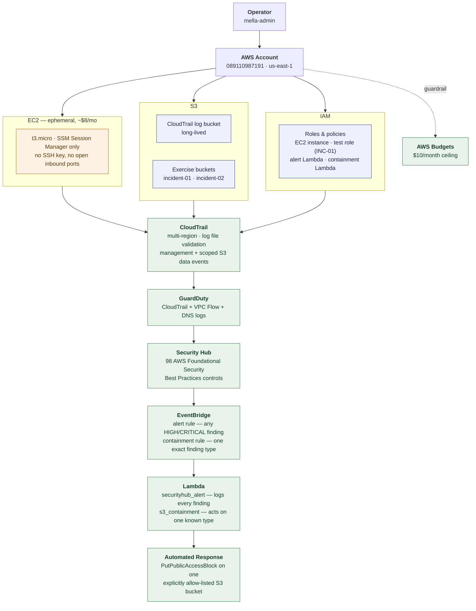

# Architecture

The big picture: one AWS account, three resource pillars feeding one
detection pipeline, ending in one narrowly-scoped automated response.

For the detailed, module-by-module diagram (every Terraform directory,
lifecycle color-coding, exact EventBridge filter criteria) see
[README.md § Architecture](../README.md#architecture) instead — this one is
deliberately the simplified, whole-lab view.

**Reading the shape:** everything above `CloudTrail` is *what the account
does* — three independent pillars (compute, storage, identity) that all
produce activity. Everything from `CloudTrail` down is *one linear
pipeline* that turns that activity into a decision: log it (always), or, for
exactly one known finding type against exactly one known resource, also fix
it. That narrowing — three sources, one pipeline, one narrow action at the
end — is deliberate; see
[docs/phase-9-automated-containment.md §1](../docs/phase-9-automated-containment.md#1-the-scope-decision)
for why "fix it" never widens past that one case.

**What actually went live, once:**
[incidents/incident-03-automated-containment.md](../incidents/incident-03-automated-containment.md)
walks this exact diagram end to end against a real event — including the
~94 hours the last arrow (`Lambda → Automated Response`) silently failed to
complete before anyone noticed.
